The Administration Panel
------------------------

Getting Started
~~~~~~~~~~~~~~~~

Creating A Season
=================

Create Season Panel
+++++++++++++++++++

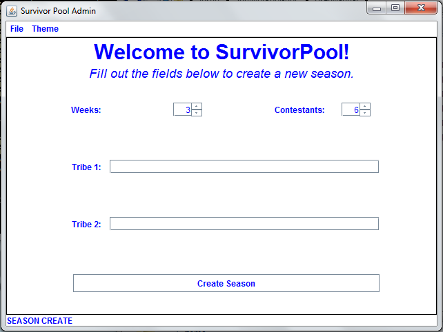

This is the very first panel you will see as an administrator.  Assuming 
everything is working properly (and trust us, it is), there should be a few 
things unique to this panel that you'll notice:
 
1. A spot for you to increase/decrease the number of weeks in this season.

2. A spot for you to increase/decrease the number of contestants in this 
   season.

3. Two spots for you to enter tribe names.

4. A button at the bottom of the panel that says "Create Season".

Modifying the number of Weeks/Contestants
^^^^^^^^^^^^^^^^^^^^^^^^^^^^^^^^^^^^^^^^^

We did what we could to keep this simple for you.  These two fields are 
synchronized, so all you need to do is set either

a. The number of contestants in your game,

or 

b. The number of weeks your game will run for.

The other field will update appropriately.  

Note: These fields abide by the standard mechanics of the game of Survivor.  You
can have no more than 15 contestants, and thus 12 weeks, and no less than 6 
contestants (3 weeks). 

Entering Tribe Names
^^^^^^^^^^^^^^^^^^^^

There's a certain etiquette to naming tribes that must be abided by for you to 
successfully start your season.  Your tribe names must be kept simple (as simple
as we keep this process for you!). The actual names are decided on the show, but
if you are going for a more personalized game, remember:

* The tribe names cannot have numbers or special characters in them.

* The tribe names must be less than or equal to 30 characters.

* The tribe names must be greater than or equal to 1 character.

Create Season
^^^^^^^^^^^^^^

When you press this button, it will check the tribe names to make sure the guide
lines indicated above have been followed properly. If they have not, the panel 
will inform you where the error exists; otherwise it will allow you to proceed 
to the `General Panel`_.

General Panel
~~~~~~~~~~~~~~

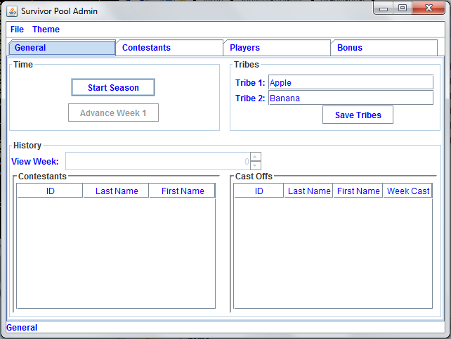

At first glance, this panel will look very busy.  We will explain this panel 
from the top down.

Tabs
======

There are four tabs at the top of the panel. Ignoring the General tab (this is 
where you currently are), we have:

* The Contestant Tab

  This is where the information for all of the contestants. For more information
  on how to work with this panel, see the `Contestant Panel`_.

* The Player Tab

  This tab leads you to the Player panel, which displays information on the 
  people that have decided to take part in the office pool.  
  For more information on how to work with this panel, see `Player Panel`_.

* The Bonus Tab
	
  This tab leads you to where you will be able to enter new or modify existing 
  questions for your players to answer. For more information on how to work with
  this panel, see `Bonus Panel`_.

Time
=====

There are two buttons in this area: Start Season and Advance Week (week number). 

Start Season
++++++++++++

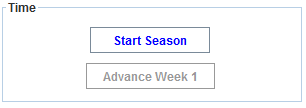

Pressing this button indicates that you are prepared to begin the game with the 
information that you have entered.  The requirements to start a season are as 
follows:

1. You must have saved a number of contestants equal to the number you set on 
   the `Create Season Panel`_.

2. You must have at least 1 person taking part in the office pool.

If you've met the requirements, a window will pop up and request that you enter 
the amount of money that each player will be contributing, and the advance week 
button will light up.

Advance Week
++++++++++++

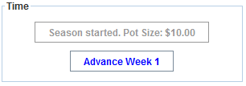

This button does quite a bit.  It will cast off whichever contestant you 
selected to be, fill in weekly and ultimate picks for whichever players 
neglected to make theirs, allocate points based off of the weekly picks, and 
update the bottom half of the `General Panel`_.  You must have selected a 
contestant to be cast off for the current week in order for this button to work.

**Note**: This button will only become active after you have started the season.
On the final week, the label on the button will change to *Advance Final Week*. 
The functionality is the same, it is just informing you that you have reached 
the final week of the competition.

Tribes
========

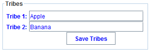

Here you will see your two tribes names and a "Save Tribes" button.  It is very 
straight forward.  If it becomes necessary to change a tribe name, you can do so
in the appropriate field (note that the restrictions applied to tribe names on 
the `Create Season Panel`_ will still apply on the `General Panel`_) and press 
*Save Tribes*. 

History
=========

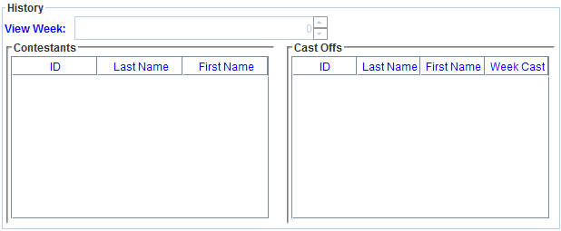

In this field, you can view who has been cast off, when they were cast off, and 
who is still active in the game.  We also give you the option to select a 
specific week to view.

View Week
+++++++++++

You can decide to view a previous week.  It will display the Contestants/Cast 
Offs tables as they looked on that week.

Contestants
+++++++++++

This table displays who is (or was) active on the current week.

Cast Offs
++++++++++

This table displays who has been cast off up to the week previous to the current
week.

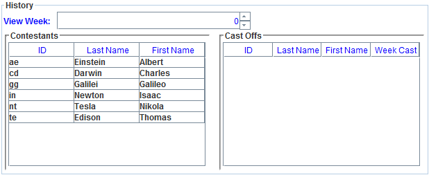

Contestant Panel
~~~~~~~~~~~~~~~~

The Contestant panel can be found by clicking the **'Contestant'** tab after the season 
has been created.

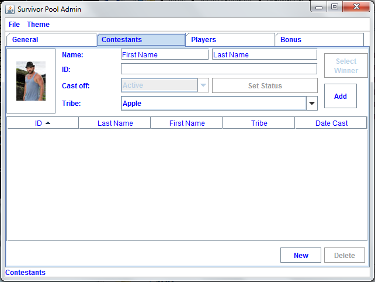

This is where the administrator can add, delete, and modify contestant data before the
season has started, as well as cast off contestants and select winners during the season.

Adding a Contestant
===================

To add a new contestant, follow these steps:

1. Press the "New" button located at the bottom of the panel to clear the contestant fields.

2. Input the contestant's first name, last name, picture and desired contestant id into the 
textfields.

3. Select the contestant's required tribe from the drop down box to the right of the "Tribe" 
label.

4. Press the "Add" button.

5. To add the next contestant, continue on by pressing "New" once again and repeat. You will 
only be able to add until the cap number of contestants has been reached.

Deleting a Contestant
=====================

To delete an existing contestant, follow these steps:

1. Select the contestant by clicking on their row within the contestant table located at the
bottom of the panel. This will fill their data into the upper field areas.

2. Press the "Delete" button located at the bottom of the panel beside the "New" button.

Modifying a Contestant
======================

To modify an existing contestant, follow these steps:

1. Select the contestant by clicking on their row within the contestant table located at the
bottom of the panel. This will fill their data into the upper field areas.

2. Change the desired contestant data by refilling the textfields as needed.

3. If the new data meets the proper requirements, pressing the "Save" button which is located
where the "Add" button once was will save the new changes into the contestant table. 

Sorting the Contestant Table
============================

To sort the contestant table, simply click on the required table heading located at the top 
of the contestant table. 

I.e. If the table needs to be sorted by first name, click the "First Name" heading.

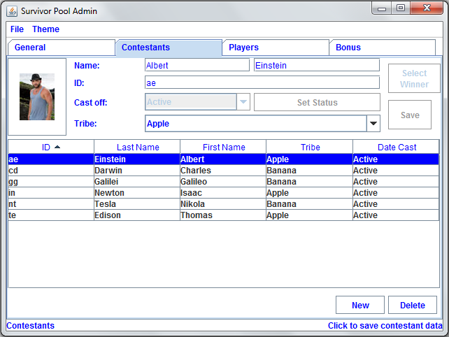

Casting Off A Contestant
========================

To cast of a contestant, follow these steps:

1. Select the contestant by clicking on their row within the contestant table located at the
bottom of the panel. This will fill their data into the upper field areas.

2. Press the drop down box located to the right of the "Cast off" Label.

3. Choose the desired week you would like the contestant to be cast off. 

4. Confirm by pressing "Set Status".
	
	a.  If you are selecting the current week as the cast off date, and there are no other 
	cast offs during the week, the cast off will proceed as normal.
	
	b. If you are selecting the current week as the cast off date, but there are other 
	contestants	cast off during the week, the cast off won't allow the change until the 
	other contestant has been set to "active" status.
	
	c. If you are selecting a past week as the cast off date, the program will confirm your
	choice before continuing, as this action will invalidate the season.

Selecting a Contestant Winner
=============================

To select a contestant winner, follow these steps:

1. Select the contestant by clicking on their row within the contestant table located at the
bottom of the panel. This will fill their data into the upper field areas. 

2. Upon reaching the final week, the "Select Winner" button located at the top right of the panel
will become activated.

3. Click "Select Winner". 

Player Panel
~~~~~~~~~~~~

The Player panel can be found by clicking the **'Player'** tab after the season 
has been created.

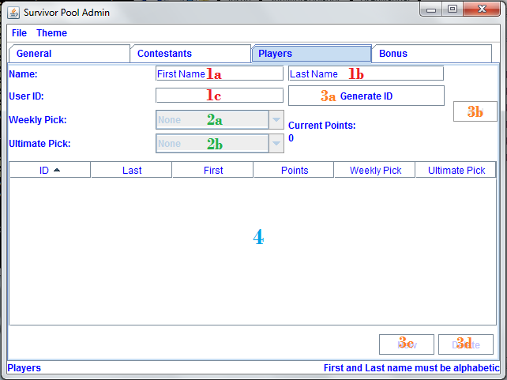

This is where the administrator can add, delete, and modify player data before the start
of the season, as well as view player progress and manually select player picks during the season.

Adding a Player
===================

To add a new player, follow these steps:

1. Press the "New" button located at the bottom of the panel to clear the player fields.

2. Input the player's first name, last name, and user id into the textfields.

3. Press the "Add" button.

4. To add the next player, continue on by pressing "New" once again and repeat.

Deleting a Player
=====================

To delete an existing player, follow these steps:

1. Select the player by clicking on their row within the player table located at the
bottom of the panel. This will fill their data into the upper field areas.

2. Press the "Delete" button located at the bottom of the panel beside the "New" button.

Modifying A Player
======================

To modify an existing player, follow these steps:

1. Select the player by clicking on their row within the player table located at the
bottom of the panel. This will fill their data into the upper field areas.

2. Change the desired player data by refilling the textfields as needed.

3. If the new data meets the proper requirements, pressing the "Save" button which is located
where the "Add" button once was will save the new changes into the player table. 

Sorting the Player Table
============================

To sort the player table, simply click on the required table heading located at the top 
of the player table. 

I.e. If the table needs to be sorted by first name, click the "First Name" heading.

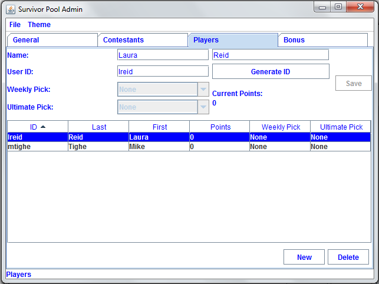

Manually Selecting a Player's Picks
===================================

To manually select a player's picks, follow these steps:

1. Select the player by clicking on their row within the player table located at the
bottom of the panel. This will fill their data into the upper field areas.

2. Using the drop down menus located beside the "Weekly Pick" and "Ultimate Pick" labels,
the administrator can manually select the required picks from the list.

3. Click the "Save" button.

Bonus Panel
~~~~~~~~~~~

The Bonus panel can be found by clicking the **'Bonus'** tab after the season 
has been created.

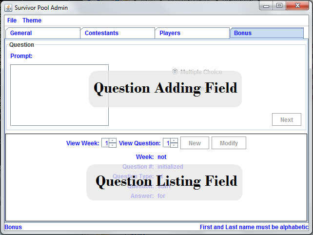

This is where an administrator can create bonus questions for the survivor      
game. 

These questions can be answered by survivor pool players to earn additional 
points.

Adding a Question
=================

To add a new bonus question, follow these steps:

1. Notice that the Bonus Panel is disabled at first; the **'New'** button will 
   become clickable after the season has been started. Click the **'New'** 
   Button to enable the **'Question Adding Field'**.
	
2. Type in your bonus question, and select one of the two bullets: 
   **'Multiple Choice'** or **'Short Answer'**.
	
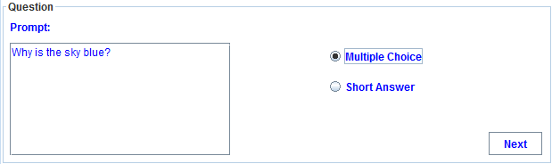
	
3. Click **'Next'** to continue.
	
4. At this point, the appropriate answer fields (depending on what type of 
   question you indicated) will be displayed. 
	
   a. If you selected **'Short Answer'**, simply type in the answer to your 
      question, and click **'Submit'** to confirm your question completion.
		
   b. If you selected **'Multiple Choice'**, fill in the four answer fields and 
      indicate which answer is correct with the bullets on the left hand side, 
      then click **'Submit'** to confirm.
		
5. The **'Back'** button can be used to edit the **'Question Adding Field'** 
   before you submit the bonus question.

Viewing Questions
=================
	
After your bonus question is submitted, it can be viewed in the 
**'Question Listing Field'** on the Bonus Panel.

Use the **'View Week'** and **'View Question'** spinners to look through all of the questions you have added.

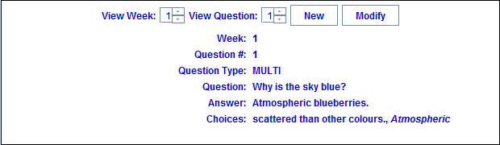

Modifying a Question
====================

Only questions added to the current week may be modified; to modify one of these
bonus questions follow these steps:

1. Click the **'Modify'** button to load a question into the 
   **'Question Adding Field'**.
	
2. Make your changes to the question, indicate the question type and click 
   **'Next'**.
	
3. Make any necessary changes to the answer fields and click **'Submit'** to 
   confirm your bonus question modification.

