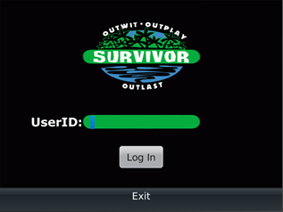
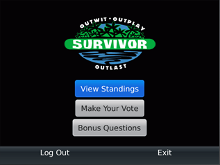
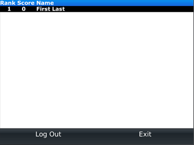
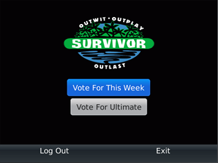
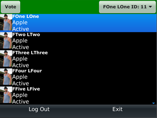
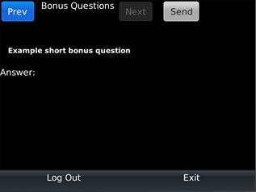

BlackBerry Client
-----------------

.. index::
   pair: Client; Log In

Log In
~~~~~~~~~~

	The Log In Screen

Enter your user id to log in to the application. Ask the admin for your user id
if you never received one.

.. index::
   triple: Client; Log In; Error

Possible Errors When Logging in
================================
:SD card not inserted: Make sure you have an SD card inserted into the device.
    Refer to the owner's manual of your device for more information.

:File not found: The admin may have not uploaded the file onto your sd card or
    is not in the right place. The file in the sdcard should be at *res/data/GameData.dat*

:Season not started: The admin has not yet started the season. The client can
    only be used when a season has been started.

:Invalid User id: The user id was not found or was incorrect. Ask the
    administrator for your user id.

.. index::
   pair: Client; Main Screen

Main Screen
~~~~~~~~~~~~

	The Main Screen

The user can `Log out` and `Exit` at any time.

Visit Standings screen for `View Standings`_ (#1).
Visit Picking contestant for `Make Your Vote`_ (#2).
Visit Bonus for `Bonus Questions`_ (#3).

.. _`View Standings`: standings_

.. _`Make Your Vote`: vote_

.. _`Bonus Questions`: bonus_

.. index::
   pair: Client; Standings Screen

Standings Screen
~~~~~~~~~~~~~~~~
.. _standings:

	Player standings

The list shows the standings of all players(users) and their respective points
and is sorted from most to least points.

.. index::
   pair: Client; Contestant Screen
   pair: Contestant; Select

Picking contestant
~~~~~~~~~~~~~~~~~~~

.. _vote:

This button is *not visible* if the season has finished.

	Vote Menu

.. index::
   pair: Weekly Pick; Select Contestant

:Vote For This Week: This will let you select the weekly pick. choose which 
    contestant is going to be casted off this week. Please see Pick Final if 
    it is the last week.

.. index::
   pair: Ultimate Pick; Select Contestant

:Vote For Ultimate: This will let you select your ultimate pick. Remeber, the 
    total number of points decreases if you change your pick.

.. index::
   pair: Final Pick; Select Contestant

:Pick Final: will only appear on the final week of play. Choose which contestant
    is going to become the ultimate winner.

	Vote Screen

The *drop down box* contains all the active contestants. If you have already 
chosen a pick, the drop down box defaults to that contestant.

Click the *vote* button to confirm your submission. The vote button will be 
called revote if a pick has already been made.

.. index:: Bonus

Bonus
~~~~~

.. _bonus:

.. index::
   pair: Bonus; Question

Only *visible* if bonus questions have been created by the administrator.

	Bonus Question screen

*Previous* and *Next* cycle through all the questions.

If the question is from a *previous* week, the *correct* and *your* answer will
be shown.

.. index::
   triple: Bonus; Answer; Question

You can only *answer* questions in the *current* week.

Click *send* to submit your answer after you have entered it.

*200* is the max number of characters for short answers.

Send changes to resend if an answer has already been submitted.

