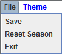
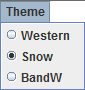
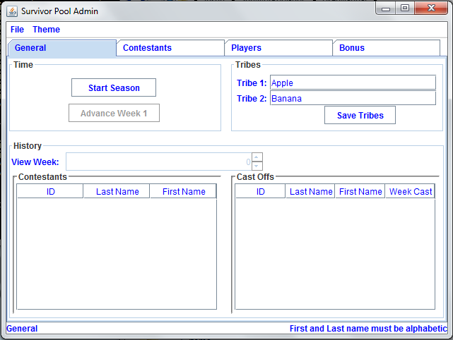
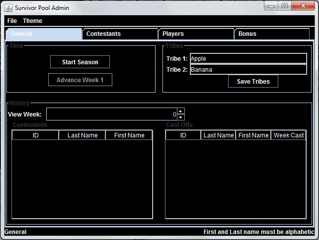
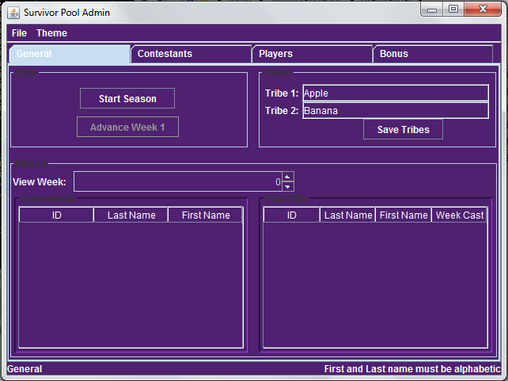

=============
The Toolbar
=============

File
~~~~~~~

Save 
--------

Selecting this will save your current game information. 

*Important: When you close your window, or select Exit from the file drop down, it will also enact the Save function.*

Reset Season
------------------

This option erases your current game information and returns you to the Create Season Panel.  You will be able to start an entirely new game.  

Selecting this feature will prompt you with a YES or NO selection. **Selecting YES is irreversible; once you have reset your season, you will be unable to get your game information back.**

Exit
------------

Closes the application.  Will envoke the Save function.

Themes
~~~~~~~~~~

Themes exist to help spice up your Survivor Pool experience.  We offer three expertly crafted colour schemes to help personalize your experience.  

Snow
-----------

This is the default scheme, and brings forth gorgeous blue fonts with a soft white background.

BandW
------------

A classic.  Stylish black and white appearance to give the application a classier look.

Western
---------------

Show off your pride for the University of Western Ontario with this theme.

